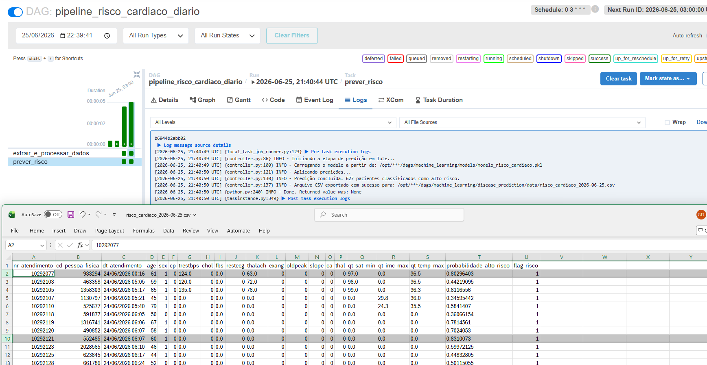
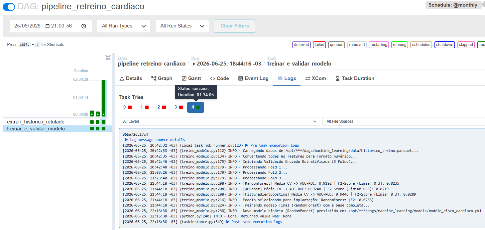

# PIPELINE DE INTELIGÊNCIA ARTIFICIAL PARA PREDIÇÃO DE RISCO CARDÍACO

## INTRODUÇÃO E CONTEXTO DO PROJETO

Este projeto consiste no desenvolvimento e na operacionalização de uma solução de Inteligência Artificial aplicada à saúde, com foco na triagem preventiva e automatizada de eventos cardíacos graves. O sistema monitora continuamente os atendimentos de urgência e internação hospitalar para identificar pacientes com alta probabilidade de desenvolver complicações cardiovasculares nas horas seguintes à triagem.

O principal objetivo de negócio e assistencial é fornecer uma camada de suporte à decisão clínica, funcionando como uma rede de proteção invisível que sinaliza alertas prioritários para a equipe de enfermagem e corpo médico. Dessa forma, o hospital consegue otimizar o gerenciamento de leitos de alta complexidade e iniciar intervenções precoces, reduzindo desfechos clínicos desfavoráveis.

## ARQUITETURA DO PIPELINE E FLUXO DE DADOS

A arquitetura foi desenhada seguindo os princípios de desacoplamento, idempotência e eficiência de recursos computacionais, utilizando o Apache Airflow como motor de orquestração e o banco de dados Oracle do sistema Tasy HTML5 como fonte primária de dados.

O ecossistema é dividido em dois fluxos principais e independentes:

**Fluxo de Inferência Diária em Lote (DAG 1):** Executado de forma automática todas as madrugadas às 03:00 UTC. Este pipeline extrai os dados clínicos consolidados das últimas 24 horas, realiza a engenharia de features em tempo de execução, carrega o modelo preditivo que está em produção no disco e exporta um relatório contendo apenas os pacientes classificados como de alto risco para a camada Gold de dados.

**Fluxo de Retreino Mensal Automatizado (DAG 2):** Executado no primeiro dia de cada mês. Este pipeline é responsável por garantir que o modelo não sofra com a degradação de performance ao longo do tempo (data drift). Ele extrai uma janela histórica completa do hospital, avalia múltiplos algoritmos simultaneamente em um ambiente de validação cruzada, seleciona o modelo campeão com base em métricas de segurança assistencial e atualiza o binário de produção de forma transparente.

## MAPEAMENTO DE FEATURES DO HEAR DISEASE PREDICTIONS PARA O ECOSSISTEMA HOSPITALAR

O modelo preditivo utiliza como base a estrutura de 13 variáveis consagradas no dataset público [Heart Disease Predictions (Kaggle)](https://www.kaggle.com/code/desalegngeb/heart-disease-predictions/notebook?scriptVersionId=127815839). Para viabilizar a aplicação prática no hospital, essas variáveis foram rigorosamente mapeadas para tabelas estruturadas e views do Tasy HTML5.

### Mapeamento Técnico de Variáveis:

- Variável Idade (age): Extraída da tabela PESSOA_FISICA campo dt_nascimento. O cálculo é feito de forma dinâmica na consulta utilizando a diferença em meses entre a data de entrada do atendimento e o nascimento, truncando o valor final para anos inteiros.

- Variável Sexo (sex): Extraída da tabela PESSOA_FISICA campo ie_sexo. É realizada uma binarização onde o caractere M é convertido em 1 e F é convertido em 0.

- Variável Tipo de Dor no Peito (cp): Mapeada a partir dos formulários parametrizados da triagem do pronto-socorro ou evolução clínica do Prontuário Eletrônico do Paciente.

- Variável Pressão Arterial Sistólica (trestbps): Mapeada diretamente do histórico de sinais vitais na tabela SINAL_VITAL_V campo qt_pa_max. O pipeline captura o maior valor de pressão sistólica registrado no período para isolar picos hipertensivos.

- Variável Colesterol Sérico (chol): Mapeada a partir dos últimos resultados laboratoriais liberados para o paciente na tabela de resultados de análises clínicas, capturando o painel lipídico.

- Variável Açúcar no Sangue em Jejum (fbs): Mapeada utilizando os registros de glicemia capilar da tabela SINAL_VITAL_V campo qt_glicemia_capilar. Uma regra de negócio embutida avalia se o maior valor registrado superou 120 miligramas por decilitro, atribuindo valor binário 1 para verdadeiro e 0 para falso.

- Variável Resultados Eletrocardiográficos (restecg): Obtida através dos laudos estruturados de exames de métodos gráficos laudados no sistema.

- Variável Frequência Cardíaca Máxima (thalach): Mapeada a partir da tabela SINAL_VITAL_V campo qt_fc. O pipeline aplica uma função de agregação para capturar a maior frequência cardíaca registrada durante o plantão.

- Variáveis de Teste Ergométrico e Segmento ST (exang, oldpeak, slope, ca, thal): Mapeadas a partir de laudos estruturados de exames cardiológicos específicos, exames de imagem e procedimentos da hemodinâmica registrados no prontuário do paciente.

- Variável Alvo (target - Usada apenas no Treino): Gerada retroativamente cruzando os atendimentos com a tabela DIAGNOSTICO_DOENCA. Se o paciente recebeu um diagnóstico confirmado com códigos CID-10 pertencentes ao grupo de Doenças Isquêmicas do Coração (intervalo de I20 a I25), o atendimento recebe o rótulo 1. Caso contrário, recebe 0.

### Enriquecimento de Features para o Contexto Hospitalar:
Para elevar a acurácia do modelo além do dataset padrão do Kaggle, foram adicionadas três variáveis clínicas cruciais extraídas da triagem: saturação mínima de oxigênio (qt_sat_min) para capturar hipóxia, índice de massa corporal máximo (qt_imc_max) para avaliar perfis de obesidade, e temperatura máxima (qt_temp_max) para isolar diagnósticos diferenciais infecciosos.

## ESTRATÉGIA DE INFERÊNCIA DIÁRIA EM LOTE (DAG 1)

O script de produção diária coleta uma média de 600 atendimentos a cada execução. Para garantir a flexibilidade do sistema, o pipeline aceita parâmetros manuais de data de início e fim via interface do Airflow para cobrir cenários de reprocessamento. Caso nenhum parâmetro seja informado, o código assume automaticamente a janela padrão de ontem (D-1).

A extração utiliza variáveis de bind nativas do driver oracledb, o que impede ataques de injeção de SQL e otimiza o plano de execução no banco do Tasy. Após a extração, o Pandas realiza o preenchimento de valores nulos e padroniza as colunas em letras minúsculas para garantir a compatibilidade exata com a ordem de entrada exigida pelo modelo serializado. Os pacientes identificados acima do limiar de risco são salvos em um arquivo com nome padronizado e idempotente contendo a data da execução.

## ESTRATÉGIA DE RETREINO MENSAL AUTOMATIZADO (DAG 2)

O pipeline de retreino foi projetado para processar volumes massivos de dados, extraindo um histórico de 8.358.143 milhões de registros do Tasy a cada rodada mensal. Devido a essa grande escala, foram implementadas duas travas de segurança de infraestrutura:

Proteção de Memória RAM por Amostragem Estratificada: Se o volume total de registros extraídos ultrapassar o limite global configurado de 15 milhões de linhas, o script intercepta o DataFrame e realiza uma amostragem estratificada limitando a base a 10 milhões de registros, preservando rigorosamente a distribuição original da variável alvo (target). Isso evita o estouro de memória (OOM Killer) no container Docker do Airflow.

Ecossistema de Modelos Concorrentes: O pipeline treina e avalia três algoritmos distintos: RandomForestClassifier (com limite de profundidade para evitar overfitting), XGBoost (utilizando o parâmetro scale_pos_weight calibrado dinamicamente com a razão entre classes para lidar com o desbalanceamento) e HistGradientBoostingClassifier (algoritmo moderno baseado em histogramas, ideal para grandes volumes de dados).

## MÉTRICAS DE AVALIAÇÃO DE NEGÓCIO: O PAPEL CRÍTICO DO F2-SCORE E CALIBRAÇÃO

A escolha das métricas de avaliação seguiu uma justificativa estritamente assistencial e de gerenciamento de risco hospitalar. Em modelos tradicionais de machine learning, adota-se o limiar de probabilidade 0.5 e avalia-se a Acurácia ou o F1-Score. No contexto de risco cardíaco, essa abordagem é perigosa.

O custo de um Falso Negativo (enviar para casa um paciente que está infartando) é dramaticamente superior ao custo de um Falso Positivo (manter em observação ou solicitar exames complementares para um paciente que não infartará). Portanto, o modelo deve priorizar a Sensibilidade (Recall).

Por essa razão, adotamos o F2-Score como métrica decisora no processo de seleção do modelo mensal. O F2-Score altera o balanço matemático para dar ao Recall um peso duas vezes maior do que o da Precisão. O limiar de decisão foi fixado globalmente em 0.3. O algoritmo que apresentar o maior F2-Score médio na validação cruzada de 3 partições (folds) é automaticamente selecionado como o novo modelo de produção.

Resultados médios obtidos no último ciclo de validação (com um treshold de 0.3):
**RandomForest:** AUC-ROC de **0.9192** e F2-Score de **0.0235**
**XGBoost:** AUC-ROC de **0.9248** e F2-Score de **0.0219**
**HistGradientBoosting:** AUC-ROC de **0.9446** e F2-Score de **0.0093**

O modelo selecionado para implantação foi o **XGBoost** com F2-Score final de **0.0235**.

## MECANISMOS DE ROBUSTEZ, IDEMPOTÊNCIA E PREVENÇÃO DE FALHAS EM PRODUÇÃO

Para garantir a estabilidade da solução em ambiente hospitalar de missão crítica, duas grandes correções de engenharia de dados foram aplicadas ao projeto atual:

Substituição do XCom por Persistência em Parquet: Inicialmente, o pipeline passava o DataFrame extraído entre as tarefas utilizando o mecanismo padrão de XCom do Airflow. Isso causava falhas críticas de estouro de alocação de memória no banco de metadados do Airflow (PostgreSQL), uma vez que o tamanho do binário excedia o limite suportado. A solução foi gravar os dados intermediários diretamente em disco no formato Parquet compactado com o motor PyArrow, transmitindo entre as tarefas apenas a string contendo o caminho físico do arquivo.

Substituição Atômica de Arquivos Binários (Pickle): Para evitar cenários de concorrência onde a DAG 1 de predição diária tenta ler o arquivo do modelo (modelo_risco_cardiaco.pkl) no exato momento em que a DAG 2 de retreino está reescrevendo o binário (o que causaria quebra por arquivo corrompido), implementamos o salvamento atômico. O novo modelo é totalmente escrito em um arquivo temporário e, somente após a conclusão bem-sucedida da escrita, o sistema operacional realiza uma troca instantânea de ponteiros utilizando a função os.replace. Isso garante que a inferência diária nunca seja interrompida.